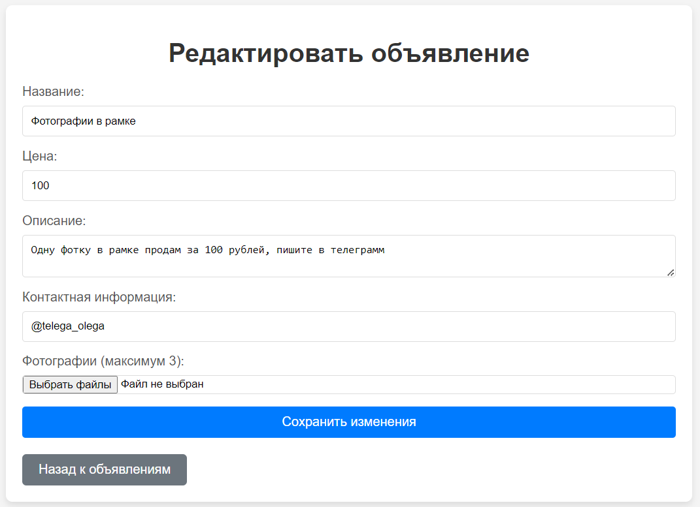

# Advertisement Manager

## Описание
It is a small web application that allows you to manage ads. It includes the ability to add ads with the necessary information about the ad: name, price, description, contacts and 3 photos. And also view existing ads on the main page. The main feature of the backend is storing photos in Yandex Cloud Storage S3.

## Technologies
- Java 17
- Spring Boot
- PostgreSQL
- Yandex Object Storage (S3)
- Thymeleaf
- Lombok
- Hibernate

## Installation
1. Clone the repository:
   ```bash
   git clone https://github.com/shymio/Java-web-app-with-api-yandex-S3.git
2. Create new database in PostgreSQL named "crudpractice"
3. Run the application.

## Endpoints
- GET /ads/new - Open the page with the form for adding an ad.
- GET /ads/{id} - Show of certain ad.
- GET / - Home page with show all ads.
- POST /ads/add - Create of an ad.

## Screenshots
Home page - here you can see all of your ads. There is working button of adding new ad.


Ad page - here you can see all information about your selected ad. 
Here you can see all the information about your selected ad. There are also buttons here. 
- "Вернуться к объявлениям" - the main page opens.
- "Редактировать" - a form opens where you can change all the information about the ad and also change the photos.
- "Удалить объявление" - when clicked, this ad will be deleted and the main page will open.


Form which can add new ad. Here you need to write all of information about your new ad. And you can add 3 or less photos to ad.


Form which can edit existing ad. Change information or photos of ad.



It's how look like storage of photos in Yandex S3.

